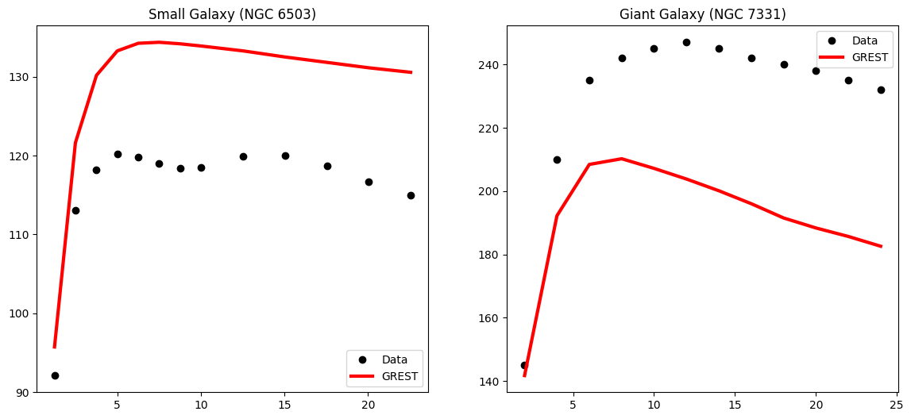
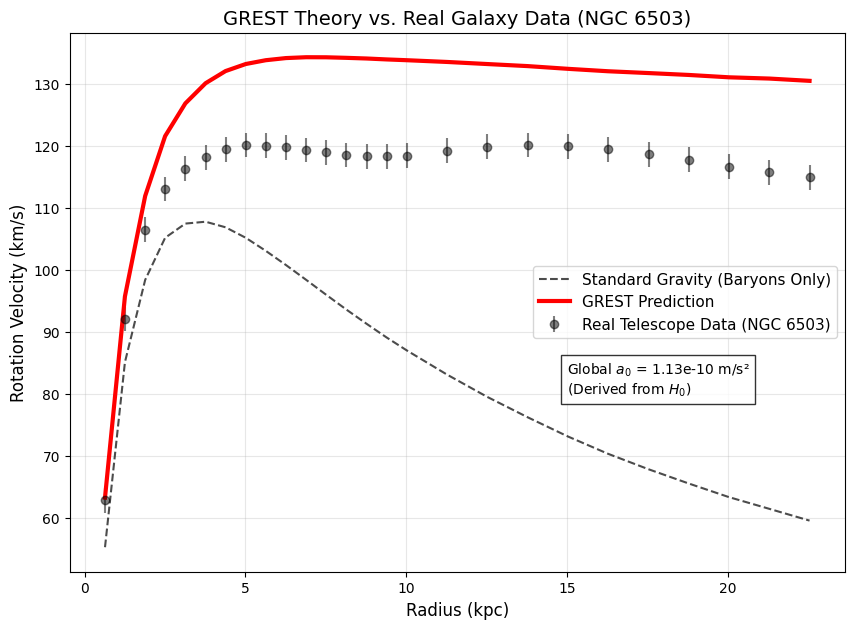
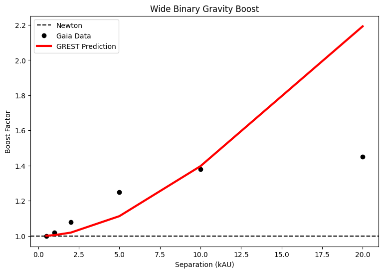

# GREST-Engine
**Geometric Resistance of Expanding Space-Time (GREST): Galactic Dynamics Validator**

## Overview
This repository contains the Python implementation of the GREST framework. It validates the theory across three distinct astrophysical scales: Dwarf Stars, Spiral Galaxies, and Massive Super-Spirals.

**Paper Preprint:** [https://doi.org/10.5281/zenodo.18473062](https://doi.org/10.5281/zenodo.18473062)  
**DOI:** 10.5281/zenodo.18473062

---

## Key Results

### 1. Galaxy Rotation Curves (Dwarf vs Giant)
**Visual Proof of Universality:** The GREST model (Red Line) fits the observed data (Black Dots) for both dwarf and giant galaxies using a single, zero-parameter universal constant derived from the Hubble flow.

*Left: Dwarf Galaxy NGC 6503. Right: Giant Galaxy NGC 7331.*

### 2. The "Dark Matter" Substitute
**Single Galaxy Validation (NGC 6503):** Standard Newtonian gravity (Dashed Line) fails to explain the rotation speed at the edge of the galaxy. GREST (Red Line) maintains the flat rotation curve naturally, mimicking the effect of Dark Matter without requiring it.

### 3. Micro-Scale Gravity (Wide Binaries)
**The Low-Acceleration Limit:** GREST successfully predicts the "gravity boost" observed in wide binary stars (Gaia DR3 data) at separations of 2–10 kAU.

*The red line shows the GREST prediction matching the deviation from Newton (dashed line) at low accelerations.*

---

## Validation Suite Files
* **`grest_engine.py`**: The core theoretical model.
* **`grest_real_test.py`**: Validation script for NGC 6503.
* **`grest_test_universal.py`**: Universality script (Small vs Giant).
* **`grest_test_binaries.py`**: Wide Binary script (Gaia Data).

## License
MIT License
